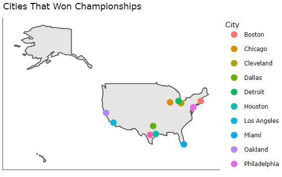
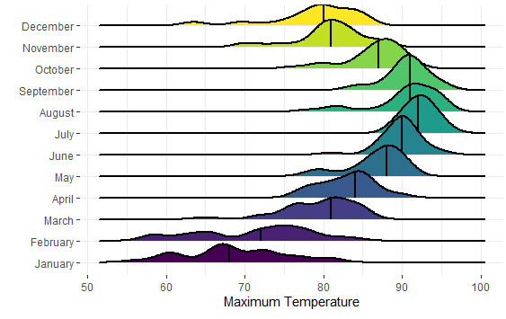

# Data Visualization and Reproducible Research

> Cadreeo Hudson.
> 
Learn more about me in my [GitHub profile page](https://github.com/Cadreeo)

The following is a sample of products created during the _"Data Visualization and Reproducible Research"_ course.

## Project 01

In the `project_01/` folder you can find my first application of data visualization where I took some data regarding the shows aired on Netflix and their increase over the years. There was also data regarding the show ratings to show how diverse their TV show and movie collection can be. 

**Sample data visualization:** 

## Project 02

In this project, I explored data sets from NBA championships from 1980 all the way to 2018. The data set interested me because I am a big sports fan and even bigger basketball fan. All the datasets were interactive and as a result allowed for a more user friendly experience. Find the code and report in the `project_02/` folder.

**Sample data visualization:** 

(you can also place your figures in the `figures/` folder and use the `` option to add the pictures here)

## Project 03

In this project, I reproduced some data visualizations shown to me to show the dataset based on Florida's climate center from my professor Dr. Rei-Sanchez. Find the code and report in the `project_03/` folder.

**Sample data visualization:** 

### Moving Forward

I would like to have a little more practice with Data Visualization as it is fun to see data come to life. More practice with mapping data and creating visualizations that way would be very interesting to pursue.
